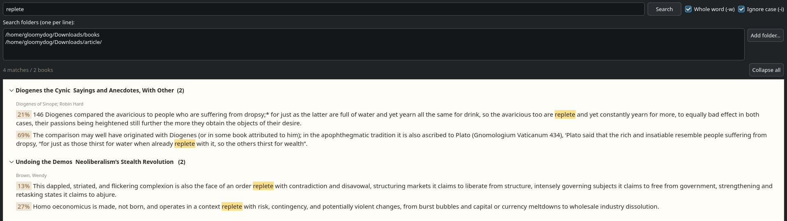

# rga Finder for Arch Linux

A small native desktop app (C++/Qt) that turns your personal library of **PDF** and
**EPUB** books into a searchable concordance. Type a word and it shows **every**
occurrence across your books, one sentence at a time, with a page or reading-position
badge. Built for language learners who want real example sentences from real books.

It uses [`rga` (ripgrep-all)](https://github.com/phiresky/ripgrep-all) under the hood
and renders results in a native window — no browser, no local server.



## Features

- **Every hit, grouped by file.** Unlike a library full-text search that returns one
  result per book, this lists all matches.
- **Sentence extraction.** Shows the full sentence containing the word (from the
  previous terminator to the next), rebuilt across line breaks for PDFs whose text is
  split into short fragments.
- **Page / position badges.** PDFs show `p.N`; EPUBs (which have no fixed pages) show a
  reading position such as `58%`.
- **Multi-language.** English, Japanese, Chinese, French, Italian, German, Spanish.
  Whole-word matching (`-w`) is disabled automatically for Japanese/Chinese, and
  sentence splitting understands both Latin (`. ! ?`) and CJK (`。！？`) terminators.
- **Multiple folders.** Search across several directories at once.
- **Partial or whole-word search**, with matches highlighted in either mode.
- **Collapsible per-file list.** Click a file heading to hide/show its matches, or use
  *Collapse all* / *Expand all*.
- **Selectable text**, so example sentences can be copied out easily.

## Requirements

- Qt 6 (`qt6-base`)
- [`ripgrep-all`](https://github.com/phiresky/ripgrep-all) (`rga`)
- `pandoc` (for EPUB) and `poppler` / `pdftotext` (for PDF)

On Arch Linux:

```bash
sudo pacman -S qt6-base ripgrep-all pandoc-cli poppler
```

## Build

```bash
g++ -std=c++17 -fPIC rga_gui.cpp -o rga-gui $(pkg-config --cflags --libs Qt6Widgets)
```

If `pkg-config` cannot find Qt 6, build with CMake instead:

```cmake
cmake_minimum_required(VERSION 3.16)
project(rga_gui LANGUAGES CXX)
set(CMAKE_CXX_STANDARD 17)
find_package(Qt6 REQUIRED COMPONENTS Widgets)
add_executable(rga-gui rga_gui.cpp)
target_link_libraries(rga-gui PRIVATE Qt6::Widgets)
```

```bash
cmake -B build && cmake --build build
```

## Install

```bash
mkdir -p ~/.local/bin
mv rga-gui ~/.local/bin/     # make sure ~/.local/bin is on your PATH
```

Then run `rga-gui` from a terminal, or add a `.desktop` entry to launch it from your
application menu.

## Usage

1. Type a search word (any supported language).
2. Enter one or more folders to search, one per line (or use **Add folder…**).
3. Press **Search**.

Results are grouped by file. Click a file heading to collapse or expand its matches.

## How it works

`rga` converts each PDF/EPUB to plain text (PDF via poppler, EPUB via pandoc) and
searches it with ripgrep, emitting JSON. The app parses that JSON, reconstructs the
sentence around each match, computes a page or position badge, and displays the results
grouped by file.

## Notes and limitations

- **Image-only (scanned) PDFs** have no text layer, so nothing can be searched in them.
  Run them through OCR first (e.g. `ocrmypdf --force-ocr in.pdf out.pdf`) to add a text
  layer.
- PDF line breaks are irregular, so words hyphenated across lines
  (`under-\nstanding`) may not join perfectly.
- Reading-position `%` for EPUBs is approximate (based on byte offset within the
  extracted text).

## License
